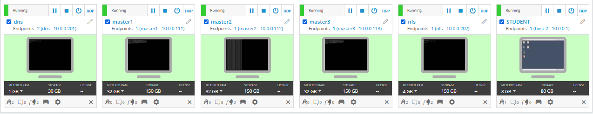
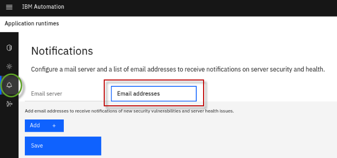
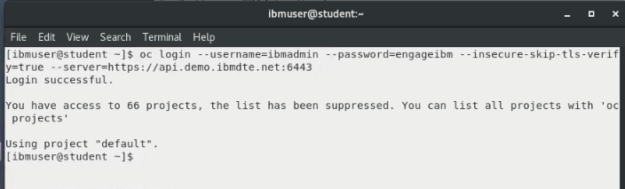
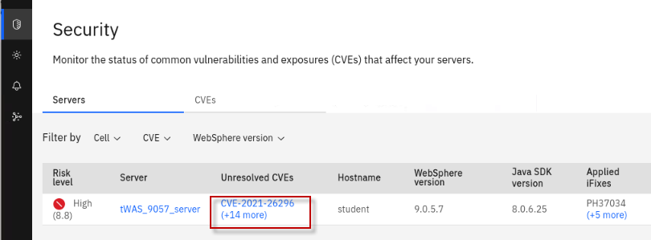
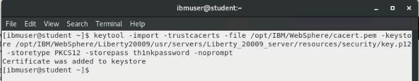
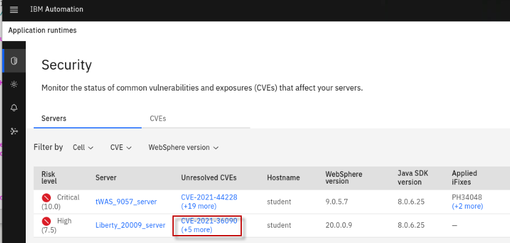
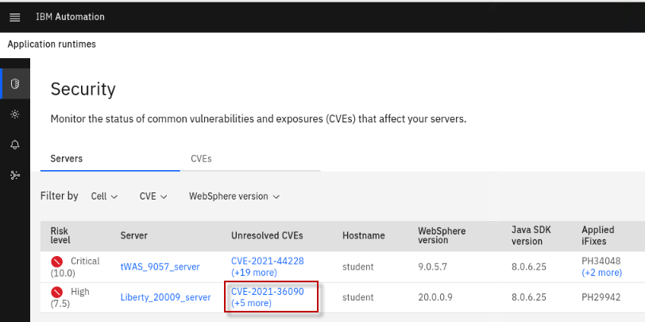
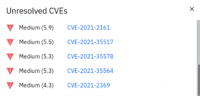
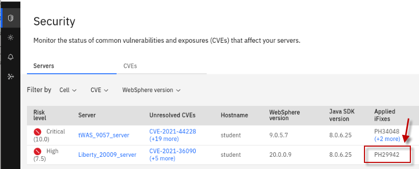

# Strengthen Operational Security with IBM WebSphere Automation

**Author(s):** Tien-Thanh Le, Ajay Apte, Jagadeeswar R Gangaraju,
Yee-Kang Chang, Rafael Osorio

**Last updated:** June 2021

**Duration:** 45 mins

Need support? Contact **Rafael Osorio** and **Kevin Postreich**

## Introduction to WebSphere Automation

[IBM WebSphere Automation](https://www.ibm.com/cloud/websphere-automation) is focused on delivering value into existing WebSphere Application Server (WAS) environments, helping administrators reduce the cost, effort, and risk of addressing common vulnerabilities, automating tasks, and remediating capacity incidents.

It removes manual toil so that your team can spend more time innovating while minimizing the cost of extending the life and maximizing the ROI of your WebSphere investments.

In conversations with customers, the same three concerns come up repeatedly. Organizations need to keep their IT estate secure and compliant, resilient to disruption and running optimally while reducing costs and maximizing ROI.

WebSphere Automation helps organizations gain visibility, operational efficiencies, and cost savings quickly by extending the life of WebSphere investments and giving teams time back to focus on unlocking new value and fixing the imbalance of pure maintenance versus innovation tasks.

  - WebSphere operators and administrators save time and embrace DevSecOps by implementing patches more efficiently on virtual and container environments to keep operations compliant and secure.

  - Enhance remediation capabilities with insights and recommendations to improve the speed and depth of understanding of outages and anomalies as they occur.

  - Augment the operational experience with access to simplified and consolidated information that enables teams to act.

With WebSphere Automation, security, business efficiency and resiliency become standard. IBM can meet you wherever you are in your optimization and automation journeys to help you quickly deliver value and increase ROI, all while laying a solid automation foundation to support future growth.

IBM WebSphere Automation is available as a stand-alone offering or as an addition to IBM Cloud Pak® for Watson AIOps. As part of IBM Automation platform, IBM WebSphere Automation includes containerized components and common software services on top of a common automation layer, to manage WebSphere’s incidents, hybrid applications, and cost with complete observability, governance, and compliance.

Deploy virtually anywhere through containers supported by Red Hat® OpenShift® software, on IBM Cloud®, on essentially any existing infrastructure on-premises, or through private and public clouds. Use only the capabilities you need with a fully modular approach that’s designed to be easy to consume.

## Business Context

You are a WebSphere Administrator, part of a WebSphere Operations Team responsible for maintaining security compliance of the WebSphere estate in the enterprise. A typical “as-is” process for maintaining security compliance for WebSphere environments is depicted below.

**Today (as-is):**

1.  IBM sends generic “FLASH” to indicate a new WAS security bulletin.

2.  You subscribe and receive IBM Security Bulletins to be aware about vulnerabilities, its potential impact, severity, and recommended solutions.

3.  Generally, WAS inventory is maintained in spreadsheets.

4.  Based on that, you check if this CVE applies to your managed inventory (Spreadsheet)

5.  You determine if an APAR / Fix Pack upgrade should be applied to    existing environment

6.  You deploy the fix to the impacted environments

7.  You update the WAS inventory (Spreadsheet) and provide up-to-date    reports to audit and compliance teams

Now, your inventory is a spreadsheet, with all the information about your servers, which versions, which operational system, which iFixes were applied, etc.

This is a very manual process and you are trying to automate it. This is
where **IBM WebSphere Automation** will help\!

You would like to have:

  - **Management dashboard:** Consolidated dashboard increases awareness and response time to common vulnerabilities and exposures (CVEs).

  - **Automated vulnerability tracking:** Let WebSphere Automation track new security bulletins across your existing traditional WebSphere and Liberty environments, on virtual machines or containers.

  - **Contextual notifications:** Receive security bulletin notifications only when new vulnerabilities affect the environment you manage, reducing noise and interruptions to the WebSphere operations team.

  - **Shared, live visibility to key stakeholders:** WebSphere operators and security compliance teams can see the real-time security posture of the WebSphere estate, accelerating action and minimizing the risk of miscommunication.

In this lab, you use the IBM WebSphere Automation to secure operations to reduce risk and meet compliance.

At the end of this lab, you will be able to connect teams with the most relevant information through a single dashboard to discover, analyze and remediate common vulnerabilities and exposures across instances. Furthermore, this information can be exported to a CSV file to be shared
amongst the broader team.

## Accessing and starting the environment

If you are doing this lab as part of an instructor led workshop (virtual or face to face), an environment has already been provisioned for you. The instructor will provide the details for accessing the lab environment,

Otherwise, you will need to reserve an environment for the lab. You can obtain one here. Follow the on-screen instructions for “**Reserve now**” option.

<https://techzone.ibm.com/my/reservations/create/60da2c20e2cb7a001f656575>

|         |           |  
| ------------- |:-------------|
|    | <strong>TIP:</strong>   If you need additional details, the step by step instructions for reserving an environment can be found in <strong>APPENDIX 1</strong> of this lab guide.|

1.  When the demo environment is provisioned, use the provided username and password to access and start the environment. You should see the following screen:

    

     WebSphere Automation is pre-installed in the OCP cluster hosted on the VMs.
	 
	  
	 
2. If the environment is **NOT** already started, go ahead, and **Start** the environment by clicking on the **Play** button. It takes about 10-15 minutes for the environment to start and stabilize.

    

      

3. You will be working on the **STUDENT** VM only. 

    All the WebSphere **images** and **iFixes** required for the lab are pre-installed:

    - /opt/IBM/WebSphere/Liberty200012/

    - /opt/IBM/WebSphere/Liberty20009/

    - /opt/IBM/WebSphere/AppServer9057/

    - /opt/IBM/WebSphere/AppServer9056/

     
	
4.  Click the screen representing the **STUDENT** VM

    

     
	
5.  Once you log in to the Student VM you will see the Desktop, which     contains all the programs that you will be using (browsers, terminal, etc.)

    The login credentials for the **STUDENT”** image is:
 
     - User ID: **ibmuser**

     - Password: **engageibm\!**
	 
	  
 
     
	 
	  

6.  You can resize the virtual desktop with the **Fit to window** button, located at the top of the Skytap environment window.

    

## Receiving vulnerability notifications

#### Accessing the WebSphere Automation UI

A WebSphere administrator sets up WebSphere Automation by registering and configuring WebSphere Application Servers and WebSphere Liberty servers for vulnerability tracking and by configuring email notifications.

WebSphere administrators can also view the results of vulnerability assessment in WebSphere Automation to plan their response for the WebSphere Application Server and WebSphere Liberty servers that they manage.

For this lab, WebSphere Automation is pre-installed on an OCP cluster. You have your individual WebSphere Automation installation. Let’s access your environment.

1.  On the *Student VM*, open a browser and enter the following URL
    (there is a WebSphere Automation link on bookmark toolbar):
	
	**Note:** It takes about 10-15 minutes for the environment to start and stabilize once it has started. If you encounter an error accessing the WebSphere Automation URL, please wait a few minutes and retry. 

    <a href="https://icp-console.apps.demo.ibmdte.net/multicloud/welcome">https://cpd-websphere-automation.apps.ocp.ibm.edu</a>

    
	
	 

2.  On the login page, select the **OpenShift authentication** as the    authentication type.

     
 
     **Note:** If necessary, accept all the warnings and certificates.  Depending on your browser, you might have to scroll down to permit
 access.

     
	
3.  Enter **ocadmin** as username and **ibmocp46** as password. And click **Log In**.

    
	
	 

4.  The ***IBM Automation Welcome page*** appears.

    

     
	
5.  On the Welcome page, open the **Menu**, click **Operate**, and
    then click **Application runtimes**.

    Application Runtimes represent the Traditional WebSphere and WebSphere Liberty servers that have been registered with IBM Automation.

     
	 
	  

6.  The Application runtimes page appears. There should be no data since no webSphere servers are registered/configured yet.

    
	
	 

7.  Before you start to register servers to the Dashboard, you need to configure an email to received notifications abouts CVEs.
    
    a.  Open the **Notification configuration** tab.

    
	
	 
	
8.  The Email server configuration is pre-configured for this lab. You only need to add your personal email to receive notifications of new security vulnerabilities.
    
    a. Click **Add email address** (1)
    
    b. Enter *your email* and click **Save** (2).

    

**Great\!** Your email is configured to receive security notifications.

In the next section, you will register servers to WebSphere Automation.

## Getting configuration parameters

Add each of your WebSphere Application Server servers and WebSphere Liberty servers to WebSphere Automation by registering them with the **usage metering** service.

To register your application servers with the usage metering service in WebSphere Automation, you must configure the usage metering feature in each application server. To configure the usage metering feature in each of your application servers, you must obtain the following usage metering details:

  - **URL**: The URL of the usage metering service in WebSphere Automation. This service registers WebSphere Application Server servers and Liberty servers with WebSphere Automation so that you can track security vulnerabilities.

  - **API Key**: The token used to authenticate the WebSphere Application Server servers and Liberty servers during the registration process.

  - **Usage metering certificate**: The certificate that contains the public key. This key allows an application server that is registering with WebSphere Automation to do an SSL handshake with the metering service.

In this section, you will get these configuration parameters. Let’s start it!

1.  Return to the desktop and open a new **terminal** window.

    
	
	 

2.  Log in as **root** user

        su root

    a. Enter the following password when prompted

        1bm2021rhjb

3.  Next, log in to the OCP Cluster using the command below:

        oc login --username=ocadmin --password=ibmocp46 --insecure-skip-tls-verify=true --server=https://api.ocp.ibm.edu:6443

    
	
	 

4.  Make sure that the project you are working on is **websphere-automation**:

        oc project websphere-automation

5.  Use the **oc** command to get the URL of the usage metering service in WebSphere Automation and save it to a file  “/opt/IBM/WebSphere/metering-url.txt”

        echo https://$(oc get route cpd -n websphere-automation -o jsonpath='{.spec.host}')/websphereauto/meteringapi > /opt/IBM/WebSphere/metering-url.txt

6.  View the contents of the saved file to ensure the URL was captured.

        cat /opt/IBM/WebSphere/metering-url.txt

    
	
	 

7.  Get the **api-key** that will be used to authenticate the WebSphere Application Server servers and Liberty servers during the registration process. Save it to a file named “/opt/IBM/WebSphere/api-key.txt”

        oc -n websphere-automation get secret automation-secure-metering-apis-encrypted-tokens -o jsonpath='{.data.automation-secure-metering-apis-sa}' | base64 -d > /opt/IBM/WebSphere/api-key.txt; echo >> /opt/IBM/WebSphere/api-key.txt

8.  View the contents of the saved file to ensure the api-key (token) was captured.

        cat /opt/IBM/WebSphere/api-key.txt

     
	 
	  

9.  Finally, get the Server certificate that is used for SSL handshake     between the servers and IBM Automation, and save it to a file named “/opt/IBM/WebSphere/cacert.pem”

        oc get secret external-tls-secret -n websphere-automation -o jsonpath='{.data.cert\.crt}' | base64 -d > /opt/IBM/WebSphere/cacert.pem

10. View the contents of the saved file to ensure the api-key (token) was captured.

        cat /opt/IBM/WebSphere/cacert.pem

    

**Great\!** Now you have all the configuration parameters necessary to register the application servers with the usage metering service in WebSphere Automation.

In the next section, you register your first server in WebSphere Automation.

## Configuring Liberty Server v20.0.0.12

In this section, you configure Liberty Server version 20.0.0.12 to register to WebSphere Automation. Since Liberty servers are easily created, you will first create a new Liberty server and start it.

1. Create a new Liberty server, version 20.0.0.12, using the command below:

        /opt/IBM/WebSphere/Liberty200012/bin/server create Liberty_200012_server

    
	
	 

2.  Now you need to configure the server to use TLS/SSL using the provided server_tls.xml file:

        cp -f /home/ibmuser/Desktop/lab_backup/liberty200012/server_tls.xml /opt/IBM/WebSphere/Liberty200012/usr/servers/Liberty_200012_server/server.xml

    a. If promted to overwite the file, enter"**y**" for yes.
	
	   

3.  Start the Liberty server:

        /opt/IBM/WebSphere/Liberty200012/bin/server start Liberty_200012_server

    
	
	 

4.  Now, you need to update the DefaultKeyStore with the server certificate to trust the server for https connection:

    The command below will import the “**cacert.pem**” file, that you saved in a previous step, into the Liberty trust store, thereby trusting the server for secure HTTPS connections from IBM Automation.

  
        keytool -import -trustcacerts -file /opt/IBM/WebSphere/cacert.pem -keystore /opt/IBM/WebSphere/Liberty200012/usr/servers/Liberty_200012_server/resources/security/key.p12 -storetype PKCS12 -storepass th1nkpassword -noprompt

    
	
	 

5.  Configure the usage metering in the new server. This is configured in the Liberty **server.xml** file.
    
    a. Open the server.xml file using the “gedit” editor

        gedit /opt/IBM/WebSphere/Liberty200012/usr/servers/Liberty_200012_server/server.xml

    b.  Add the **usageMetering-1.0** feature to the existing features in the <featureManager\> element, as illustrated below:

        <feature>usageMetering-1.0</feature>
		
	
    
	
	 

    c.  In the server.xml file, add the **usageMetering** element below:

        <usageMetering url="<metering-url>" apiKey="<api-key>" sslRef="defaultSSL"/>
    	
    
	
	 

    d.  You need to replace the \<**metering-url**\> with the output of the following command. Open another terminal window, and run the cat command  below:

        cat /opt/IBM/WebSphere/metering-url.txt

     

    e.  Replace **\<api-key\>** above with the output of the following cat     command. Use the second terminal to run the cat command:

        cat /opt/IBM/WebSphere/api-key.txt

    
	
	 

6.  **Save** and **Close** the server.xml file.

     

7.  In the WebSphere Automation UI, list the new Liberty server that was registered.
    
    a.  Back to the WebSphere Automation Dashboard on your browser, open the **Servers** view

    
	
	 

    b.  Confirm that the Liberty server is registered to WebSphere Automation Application runtimes page.

|         |           |  
| ------------- |:-------------|
|    | <strong>IMPORTANT:</strong>    If the IBM Automation UI does not automatically detect the Liberty server that you registered, then it is extremely likely that the server.xml file has not been configured correctly.    - Review the <strong>server,xml</strong> configuration.    - Ensure the <strong>usageMetering-1.0</strong> feature is included in the list of features.    - Ensure the usageMetering <strong>url</strong> is CORRECT. No additional characters or spaces.    - Ensure the usageMetering <strong>apiKey</strong> is CORRECT. No additional characters or spaces.    - Ensure the usageMetering parameters that you modified are surrounded by **double-quotes**.

<!--
<table>
<tbody>
<tr class="odd">
<td></td>
<td>
<strong>IMPORTANT:</strong>

If the IBM Automation UI does not automatically detect the Liberty server that you registered, then it is extremely likely that the server.xml file has not been configured correctly.

<ul>
<li>
Review the <strong>server,xml</strong> configuration.
</li>
<li>
Ensure the <strong>usageMetering-1.0</strong> feature is included in the list of features.
</li>
<li>
Ensure the usageMetering <strong>url</strong> is CORRECT. No additional characters or spaces.
</li>
<li>
Ensure the usageMetering <strong>apiKey</strong> is CORRECT. No additional characters or spaces.
</li>
<li>
Ensure the usageMetering parameters that you modified are surrounded by double-quotes.
</li>
</ul></td>
</tr>
</tbody>
</table>
-->

If the Liberty server was successfully registered, it is displayed in the Application Runtimes in IBM automation UI.

|         |           |  
| ------------- |:-------------|
|    | <strong>TIP:</strong>   <strong>Note:</strong> New vulnerabilities are discovered constantly, so the number of CVEs discovered may be different than illustrated.

   
<!--
<table>
<tbody>
<tr class="odd">
<td>

</td>
<td>
<strong>TIP:</strong>

Maybe your server vulnerability is a little bit different than illustrated above.

That is a possibility, since new vulnerabilities are constantly discovered.
</td>
</tr>
</tbody>
</table>
-->
## Configuring Liberty Server v20.0.0.9

In this section, you configure another Liberty Server to your WebSphere Automation dashboard. The process is the same (using the usage metering service in WebSphere Automation). However, to simplify the lab, we have pre-created the configuration files to make the configuration simpler.

1.  Return to the Terminal window where you are logged in as “**root**”.

    **Tip:** You can run the “**whoami**” command in the terminal window to determine the currently logged in user.

      
   
2.  First, you need to create the Liberty server version 20.0.0.9, using the command below:

        /opt/IBM/WebSphere/Liberty20009/bin/server create Liberty_20009_server

3.  Since you have already configured **usageMetering** feature for Liberty version 20.0.0.12, we have a provided couple of server.xml files to make the configuration simpler.
    
    a.  Copy the **tls configuration** that we provided, to the new Liberty server configuration.

        cp -f /home/ibmuser/Desktop/lab_backup/liberty20009/server_tls.xml /opt/IBM/WebSphere/Liberty20009/usr/servers/Liberty_20009_server/server.xml
		
	b. If promted to overwite the file, enter"**y**" for yes.
	
	   

4.  Start the Liberty server:

        /opt/IBM/WebSphere/Liberty20009/bin/server start Liberty\_20009\_server

5.  Update the DefaultKeyStore with the server certificate to trust the server for https connections:

        keytool -import -trustcacerts -file /opt/IBM/WebSphere/cacert.pem -keystore /opt/IBM/WebSphere/Liberty20009/usr/servers/Liberty_20009_server/resources/security/key.p12 -storetype PKCS12 -storepass th1nkpassword -noprompt

6.  Copy the server.xml that contains the usageMetering feature and properties (url, api-key):

        cp -f /home/ibmuser/Desktop/lab_backup/liberty20009/server_configured.xml /opt/IBM/WebSphere/Liberty20009/usr/servers/Liberty_20009_server/server.xml
		
	a. If promted to overwite the file, enter"**y**" for yes.
	
	   

7.  Back to the WebSphere Automation dashboard, confirm that the 2nd Liberty server is registered.

    
 
    The dashboard shows that this server is vulnerable for some CVEs
	
	 

8.  Click on the “**+1 more**” under the Unresolved CVEs for the Liberty\_20009\_server, to see the list of the unresolved CVEs, including the CVE-2020-10693.

    **Note** that the +1 could be different if additional CVEs have been discovered since the time of this writing.

    

    a.  The list of Unresolved CVEs for Liberty version **20.0.0.9** should include **CVE-2020-10693**

    

    b. Check your email that you registered with IBM automation. A mail notification was sent indicating the vulnerability.

|         |           |  
| ------------- |:-------------|
|    | <strong>Infromation:</strong>   In the email message, there will be a link that would redirect to the console to show more details on the vulnerability.   However, Because of network restrictions in the lab environment, this link will not work.

<!--
<table>
<tbody>
<tr class="odd">
<td></td>
<td>
<strong>Information:</strong>

In the email message, there will be a link that would redirect to the console to show more details on the vulnerability.

However, Because of network restrictions in the lab environment, this link will not work.
</td>
</tr>
</tbody>
</table>
-->

  

## Configuring traditional WeebSphere (tWAS) v9.0.5.6

In this section, you configure a traditional WebSphere Application
Server to your WebSphere Automation dashboard. With traditional
WebSphere, you use the wsadmin script to configure the usage metering
service.

1.  First, let’s start the traditional WebSphere (tWAS) 9.0.5.6 server. Return to the terminal window and execute the command below:

        /opt/IBM/WebSphere/AppServer9056/bin/startServer.sh tWAS_9056_server

    
	
	 

2.  Configure usage-metering using the wsadmin script below:

    The wsadmin command invokes a Pythin script named configuretWasUsageMetering.py. The script requires the same **url** and **apiKey** that you gathered earlier from the IBM automation environment. These parameters are captured from the text files that you saved earlier in the lab and inserted into the url and apiKey parameters.

        /opt/IBM/WebSphere/AppServer9056/bin/wsadmin.sh -f /api-usagemetering/scripts/configuretWasUsageMetering.py url=$(cat /opt/IBM/WebSphere/metering-url.txt) apiKey=$(cat /opt/IBM/WebSphere/api-key.txt) trustStorePassword=th1nkpassword

    The script should run successfully as illustrated below.

    
	
	 

3.  Great, you first traditional WAS server is configured. Let’s check our WebSphere Automation dashboard. Back to the browser, dashboard, confirm that the tWAS v9.0.5.6 is registered.

    
 
    You should see that this server is vulnerable to 14 or more CVEs. 

	|         |           |  
    | ------------- |:-------------|
    |    | <strong>TIP:</strong>  <strong>Note:</strong> New vulnerabilities are discovered constantly, so the number of CVEs discovered may be different than illustrated.

<!--
	<table>
	<tbody>
	<tr class="odd">
	<td></td>
	<td>
<strong>TIP:</strong>

	
<strong>Note:</strong> New vulnerabilities are discovered constantly, so the number of CVEs discovered may be different than illustrated.
</td>
	</tr>
	</tbody>
	</table>
-->

4.  Check your email. A mail notification was sent showing the vulnerability.

    

## Configuring traditional WebSphere (tWAS) v9.0.5.7

In this section, you configure another version of a traditional
WebSphere Application Server to your WebSphere Automation dashboard. The
steps here are the same of the last section.

1.  First, you just need to start the tWAS 9.0.5.7 server. On the terminal window, execute the command below:

        /opt/IBM/WebSphere/AppServer9057/bin/startServer.sh tWAS_9057_server

2.  Again, you need to configure the usage-metering.

        /opt/IBM/WebSphere/AppServer9057/bin/wsadmin.sh -f /api-usagemetering/scripts/configuretWasUsageMetering.py url=$(cat /opt/IBM/WebSphere/metering-url.txt) apiKey=$(cat /opt/IBM/WebSphere/api-key.txt) trustStorePassword=th1nkpassword

3.  **Great,** your second traditional WAS server is configured. Check our WebSphere Automation dashboard. Back to the browser, dashboard, confirm that the tWAS v9.0.5.7 is registered.

    

    You should see that this server is vulnerable to CVE-2021-26296.

    As explained before, maybe your server has more vulnerability than illustrated above, since new vulnerabilities are constantly discovered.

     

4.  Again, check your email. A mail notification was sent showing the vulnerability.

    

## Update Liberty server v20.0.0.9 to fix the vulnerability

In this section, you will fix one vulnerability in our Liberty Server
v20.0.0.9 using two different approaches. First, you fix by only
updating the configuration. Later, you apply an iFix to solve the
vulnerability.

### Updating configurations

Liberty 20.0.0.9 is impacted by CVE-2020-10693. This is because it
configures the **beanValidation-2.0** feature. See
[CVE-2020-10693](https://www.ibm.com/support/pages/node/6348216)
for more info.

We should resolve this by applying the iFix **PH29942** as documented in
the CVE-2020-10693. However, for the lab, we can also do a quick test by
unconfiguring this feature, to illustrate that IBM Automation does
interrogate the Liberty Server configuration, to determine if a Liberty
server is impacted by a CVE that is the result of a specific
configuration feature. This is valuable because IBM Automation can
pinpoint specific servers that are impacted not ONLY based on the
version of server, but also the specific configuration that is impacted
by the CVE.

1.  Edit the server.xml, using the command below:

        gedit /opt/IBM/WebSphere/Liberty20009/usr/servers/Liberty_20009_server/server.xml

2.  Comment out the **beanValidation-2.0** feature:

        <!-- <feature>beanValidation-2.0</feature> -->

    
	
	 

3.  **Save** and **close** the *server.xml* file.

     

4.  Back to your browser, check that the Liberty 20.0.0.9 server does **NOT** show the **CVE-2020-10693** vulnerability. The update is picked up automatically.

    
 
    Great, you removed the vulnerability by updating the configuration.

### Resolve the issue By Applying an IFIX

However, instead of removing the beanValidationFeature-2.0, the correct
process is to apply the appropriate iFix to get rid of the
vulnerability.

1.  First, add back the beanValidation feature:

        gedit /opt/IBM/WebSphere/Liberty20009/usr/servers/Liberty_20009_server/server.xml

2.  Uncomment the **beanValidation-2.0** feature:

        <feature>beanValidation-2.0</feature> 

    
	
	 

3.  **Save** and **Close** the server.xml file.

     

4.  Back to the browser, make sure the vulnerability shows up again.

    
	
	 

5.  You need to **stop** the server before the iFIx can be applied. Return to the terminal window and run the command below to stop the Liberty2009 server.

        /opt/IBM/WebSphere/Liberty20009/bin/server stop Liberty_20009_server

6. Now, apply the iFix, by running the following command.

    **Note:** We have already downloaded the iFixes used for this lab. They are stored in **/iFix** directory on the **STUDENT** VM.

        /iFix/PH29942/imcl_ifix_install.sh 20009

    
	
	 

7. Great, the iFix was applied. Now, start the server again:

        /opt/IBM/WebSphere/Liberty20009/bin/server start Liberty_20009_server

8. Return to the **WebSphere Automation Dashboard.** You should notice that the **CVE-2020-10693** was removed from the Liberty_20009_server.

    

## Update tWAS server v9.0.5.7 to fix the vulnerability

In this section, you will apply an iFix to the traditional WebSphere
9.0.5.7 server to remove the **CVE-2021-26296** vulnerability.

1.  Notice in the IBM Automation console that tWAS 9.0.5.7 is vulnerable to CVE-2021-26296.

    

    Now, you will fix it by applying the appropriate iFix.
	
	 	 

2.  First, stop the server, wait until it has stopped:

        /opt/IBM/WebSphere/AppServer9057/bin/stopServer.sh tWAS_9057_server

    
	
	 

3.  Run the following script to install the iFix:

        /iFix/PH34711/imcl_ifix_install.sh 9057

    
	
	 

4.  Start the server once the iFIX installation has completed:

        /opt/IBM/WebSphere/AppServer9057/bin/startServer.sh tWAS_9057_server

5.  Go back to the WebSphere Automation dashboard. Notice that the **CVE-2021-26296** was removed from **tWAS 9.0.5.7**. Also, you can see on the right under “Applied iFixes” there are 4 applied fixes.

    

## Update tWAS server v9.0.5.7 to introduce the vulnerability back (optional)

You can remove the iFix that was applied to confirm that the
CVE-2021-26296 shows up in the unresolved CVE list

1.  Stop the server:

        /opt/IBM/WebSphere/AppServer9057/bin/stopServer.sh tWAS_9057_server

2.  Uninstall the iFix:

        /iFix/PH34711/imcl_ifix_uninstall.sh 9057

3.  Start the server:

        /opt/IBM/WebSphere/AppServer9057/bin/startServer.sh tWAS_9057_server

4.  Go back to the WebSphere Automation Dashboard on your browser.
    Notice that **CVE-2021-26296** is now again in the tWAS 9.0.5.7
    server:

    

## Summary

Congratulations! You have completed the WebSphere Automation lab.

With automated tooling and insights, IBM WebSphere Automation enables
teams to modernize and secure IT estates, adapt and respond to incidents
efficiently, and optimize WebSphere operations. WebSphere system
operators and administrators can reduce the cost, effort, and risk of
addressing vulnerabilities, automate critical activities, and preserve
uptime with early detection, notification, and remediation of incidents.

IBM WebSphere Automation helps teams remove manual toil to work less on
maintenance tasks and more on strategic activities, while unlocking new
value, extending the life, and increasing ROI of WebSphere investments.

IBM WebSphere Automation is part of IBM Automation, a set of shared
automation services that help you get insight into how your processes
run, visualize hotspots and bottlenecks, and use financial impact
information to prioritize which issues to address first.

To learn more about IBM WebSphere Automation, visit
[ibm.com/cloud/websphere-automation](http://ibm.com/cloud/websphere-automation).

# **Appendix 1: Reserve an environment for the lab**

|         |           |  
| ------------- |:-------------|
|    | <strong>IMPORTANT:</strong>   Reserving an environment ONLY applies if you are performing this lab as self-paced outside of an instructor led virtual lab.   A Skytap cloud lab environment is required for performing the lab.   In <strong>self-paced mode</strong>, you are required to request an environment using the instructions provided below.   Otherwise, in an <strong>instructor led</strong> lab, the lab instructor will provide access to pre-provisioned lab environment.

<!--
<table>
<tbody>
<tr class="odd">
<td></td>
<td>
<strong>IMPORTANT!</strong>

Reserving an environment ONLY applies if you are performing this lab as self-paced outside of an instructor led virtual lab.

A Skytap cloud lab environment is required for performing the lab.

In <strong>self-paced mode</strong>, you are required to request an environment using the instructions provided below.

Otherwise, in an <strong>instructor led</strong> lab, the lab instructor will provide access to pre-provisioned lab environment.
</td>
</tr>
</tbody>
</table>
-->

1.  Use the link below to access the WebSphere Foundation Bootcamp

    <https://techzone.ibm.com/my/reservations/create/60da2c20e2cb7a001f656575>

    a.  Use your **IBM ID** to login to the IBM Technology Zone

    b.  The **Create a reservation** page is displayed

     
	 
	  

2.  Select “**Reserve for Now**” Radio button, and then follow the
    on-screen dialog to reserve an environment in a Skytap data center
    in the closest Geography (US-Central, EMEA, Asia Pacific)
    
    a.  The environment **name** should be pre-filled with “**WebSphere
        Automation Environment – Skytap**”
    
    b.  **Purpose**: Practice / Self-Education
    
    c.  **Description**: Enter a description. The field is required.
    
    d.  **End date and time**: Use the calendar widget and select the
        maximum date available (2 weeks from date of reservation)
    
    e.  **Select a time**: Select a time of day for reservation to
        expire
    
    f.  Select a **timezone** nearest to you

    

3.  Preferred Geography: Choose a Skytap datacenter in the closest
    geography (US, EMEA, Asia Pacific)

    
	
	 

4.  One complete, click on the “**Submit**” Button

     

5.  The reservation takes a moment to be created. When it is created,
    click on the “**My reservations**”
     button to see the detail so of
    the environment reservation.

    **Note:** The details of your environment reservation are displayed.

6.  Take not of the **Username** and **Password**. Then click the
     icon to navigate to the Launch
    page.

    
	
	 

7.  Click the “**Open Your Skytap Environment**” link.

     

8.  Enter the **Desktop Password** for the VM access, that was generated
    for your environment. Click **Submit** button.

    

### **The lab environment**

Eight Linux VM has been provided for this lab.

Note: The **STUDENT** VM is the VM you will login to and use in the lab.

The login credentials for the **STUDENT”** image is:

  - User ID: **ibmuser**
 
  - Password: **engageibm\!**
